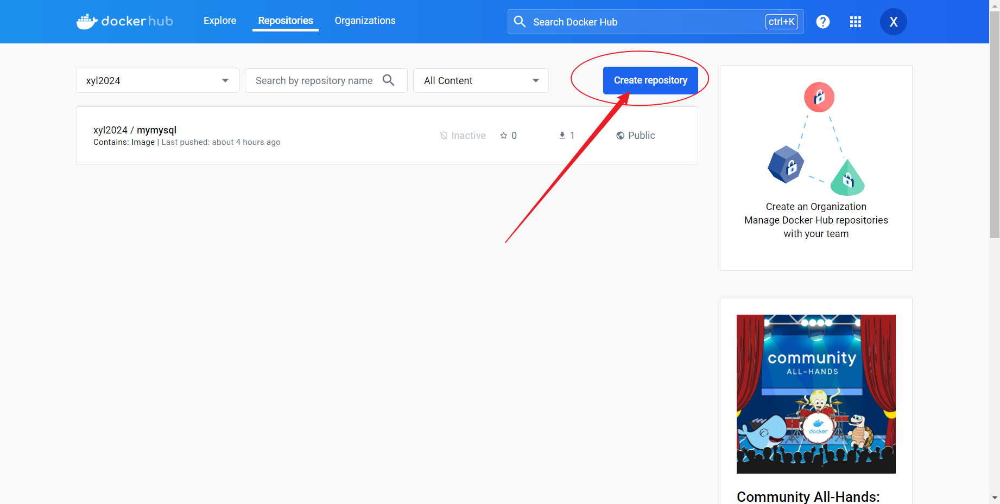
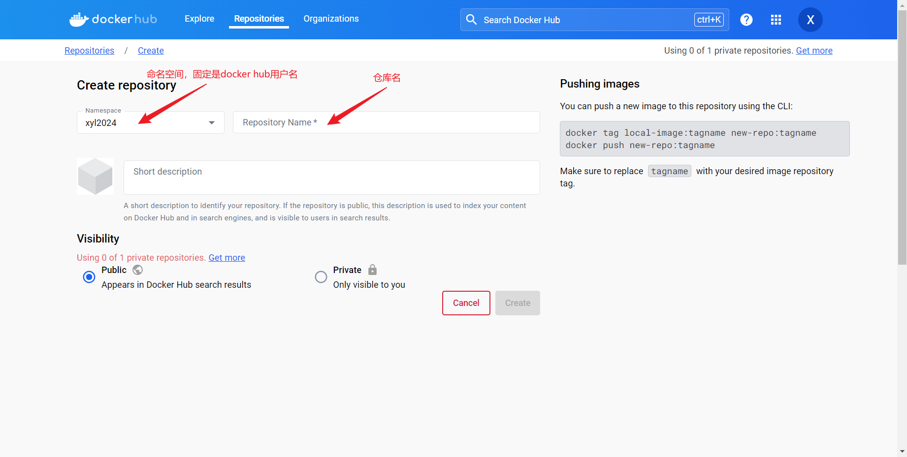
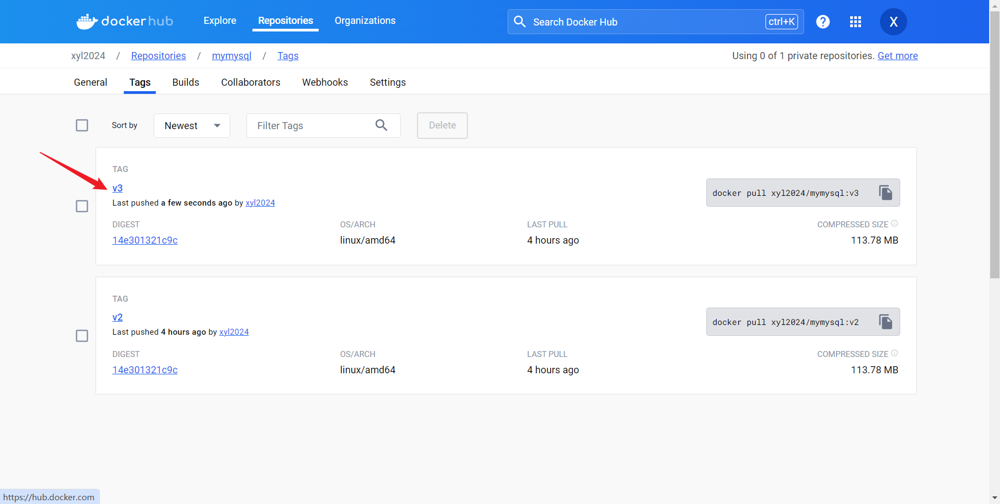
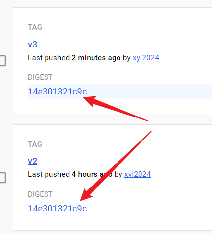
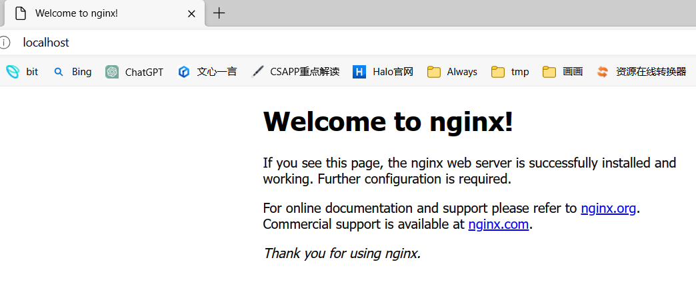
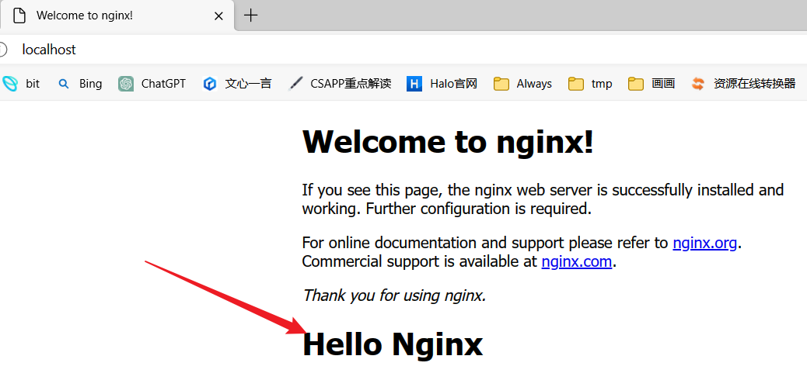

# 虚拟化 & 容器化

# 为什么虚拟化 & 容器化？

# 虚拟化实现方式

# 命令-镜像仓库

# 命令-镜像

# 命令-容器

## docker run命令

--link参数

```bash
C:\Users\xyl>docker images
REPOSITORY        TAG           IMAGE ID       CREATED        SIZE
xyl2024/mymysql   v2            8bc03bf9fa62   3 days ago     370MB
nginx             1.24.0-perl   f752d945ab68   9 months ago   189MB
centos            7             eeb6ee3f44bd   2 years ago    204MB

### 开启mycentos1容器
C:\Users\xyl>docker run --name="mycentos1" -it eeb6ee3f44bd bash

### 开启mycentos2容器，并连接mycentos1
C:\Users\xyl>docker run --name="mycentos2" -it --link mycentos1:mywebsite1 eeb6ee3f44bd bash
### 然后就可以ping通mycentos1和mywebsite1，mywebsite1是mycentos1的别名
[root@ad5bad5a9a4e /]# ping mycentos1
PING mywebsite1 (172.17.0.2) 56(84) bytes of data.
64 bytes from mywebsite1 (172.17.0.2): icmp_seq=1 ttl=64 time=2.43 ms
64 bytes from mywebsite1 (172.17.0.2): icmp_seq=2 ttl=64 time=0.071 ms
64 bytes from mywebsite1 (172.17.0.2): icmp_seq=3 ttl=64 time=0.078 ms
64 bytes from mywebsite1 (172.17.0.2): icmp_seq=4 ttl=64 time=0.080 ms
64 bytes from mywebsite1 (172.17.0.2): icmp_seq=5 ttl=64 time=0.144 ms
64 bytes from mywebsite1 (172.17.0.2): icmp_seq=6 ttl=64 time=0.079 ms
64 bytes from mywebsite1 (172.17.0.2): icmp_seq=7 ttl=64 time=0.114 ms
^C
--- mywebsite1 ping statistics ---
7 packets transmitted, 7 received, 0% packet loss, time 6229ms
rtt min/avg/max/mdev = 0.071/0.428/2.433/0.818 ms
[root@ad5bad5a9a4e /]# ping mywebsite1
PING mywebsite1 (172.17.0.2) 56(84) bytes of data.
64 bytes from mywebsite1 (172.17.0.2): icmp_seq=1 ttl=64 time=0.047 ms
64 bytes from mywebsite1 (172.17.0.2): icmp_seq=2 ttl=64 time=0.089 ms
64 bytes from mywebsite1 (172.17.0.2): icmp_seq=3 ttl=64 time=0.085 ms
64 bytes from mywebsite1 (172.17.0.2): icmp_seq=4 ttl=64 time=0.084 ms
^C
--- mywebsite1 ping statistics ---
4 packets transmitted, 4 received, 0% packet loss, time 3134ms
rtt min/avg/max/mdev = 0.047/0.076/0.089/0.018 ms

### 本质上是在mycentos2路由表中添加了DNS解析
[root@ad5bad5a9a4e /]# cat /etc/hosts
127.0.0.1       localhost
::1     localhost ip6-localhost ip6-loopback
fe00::0 ip6-localnet
ff00::0 ip6-mcastprefix
ff02::1 ip6-allnodes
ff02::2 ip6-allrouters
172.17.0.2      mywebsite1 0926b6e1479f mycentos1 ### 这里这里
172.17.0.3      ad5bad5a9a4e
[root@ad5bad5a9a4e /]#
```


# 学会使用docker hub

docker hub跟github一样，允许我们创建仓库（公有/私有）







创建完仓库后，我们可以向仓库推送镜像。


推送镜像前，需要先登录，否则会被denied

```bash
### 先给本地某个镜像命名并打上标签，命名时必须是 [命名空间]/[仓库名]:[标签]
C:\Users\xyl>docker tag xyl2024/mymysql:v2 xyl2024/mymysql:v3

C:\Users\xyl>docker push xyl2024/mymysql:v3
The push refers to repository [docker.io/xyl2024/mymysql]
98e47e248125: Layer already exists
8f945fb105ca: Layer already exists
e4fd127030cb: Layer already exists
4f742f387120: Layer already exists
8aaf7e154c30: Layer already exists
5a805c93ca37: Layer already exists
0c97cdd8acc0: Layer already exists
a1360aae5271: Layer already exists
errors:
denied: requested access to the resource is denied
unauthorized: authentication required
```

先登录后，就可以push了。

```bash
C:\Users\xyl>docker login
Log in with your Docker ID or email address to push and pull images from Docker Hub. If you don't have a Docker ID, head over to https://hub.docker.com/ to create one.
You can log in with your password or a Personal Access Token (PAT). Using a limited-scope PAT grants better security and is required for organizations using SSO. Learn more at https://docs.docker.com/go/access-tokens/

Username: xyl2024
Password:
Login Succeeded

C:\Users\xyl>docker push xyl2024/mymysql:v3
The push refers to repository [docker.io/xyl2024/mymysql]
98e47e248125: Layer already exists
8f945fb105ca: Layer already exists
e4fd127030cb: Layer already exists
4f742f387120: Layer already exists
8aaf7e154c30: Layer already exists
5a805c93ca37: Layer already exists
0c97cdd8acc0: Layer already exists
a1360aae5271: Layer already exists
v3: digest: sha256:14e301321c9c56ca7280a28fffda1933ebcf6c270ba5fdd9cb026a8965820e33 size: 1990
```

推送成功。如图所示




> 另外，我们可以看到，v2和v3的digest值是一样的。因为我们是用v2去制作v3镜像的，所以两个镜像完全相同。只是被打上了不同标签。这也是为什么在push的时候，一直提示 Layer alread exists 的原因，docker hub 不会重复存储相同的文件。
> 
> 


---

# 关于nginx

- 查看当前系统：

```bash
alonely@DESKTOP-3M5BE4L:~$ cat /etc/*release*
DISTRIB_ID=Ubuntu
DISTRIB_RELEASE=22.04
DISTRIB_CODENAME=jammy
DISTRIB_DESCRIPTION="Ubuntu 22.04.3 LTS"
PRETTY_NAME="Ubuntu 22.04.3 LTS"
NAME="Ubuntu"
VERSION_ID="22.04"
VERSION="22.04.3 LTS (Jammy Jellyfish)"
VERSION_CODENAME=jammy
ID=ubuntu
ID_LIKE=debian
HOME_URL="https://www.ubuntu.com/"
SUPPORT_URL="https://help.ubuntu.com/"
BUG_REPORT_URL="https://bugs.launchpad.net/ubuntu/"
PRIVACY_POLICY_URL="https://www.ubuntu.com/legal/terms-and-policies/privacy-policy"
UBUNTU_CODENAME=jammy
```

- Ubuntu 安装 nginx：

```bash
sudo apt update
sudo apt install nginx -y
```

- 查看是否nginx启动：

```bash
alonely@DESKTOP-3M5BE4L:~$ ps -ef | grep nginx
root      1629   544  0 22:49 ?        00:00:00 nginx: master process nginx
www-data  1630  1629  0 22:49 ?        00:00:00 nginx: worker process
www-data  1631  1629  0 22:49 ?        00:00:00 nginx: worker process
www-data  1632  1629  0 22:49 ?        00:00:00 nginx: worker process
www-data  1633  1629  0 22:49 ?        00:00:00 nginx: worker process
www-data  1634  1629  0 22:49 ?        00:00:00 nginx: worker process
www-data  1635  1629  0 22:49 ?        00:00:00 nginx: worker process
www-data  1636  1629  0 22:49 ?        00:00:00 nginx: worker process
www-data  1637  1629  0 22:49 ?        00:00:00 nginx: worker process
alonely   1640   546  0 22:49 pts/7    00:00:00 grep --color=auto nginx
```

- 杀死nginx进程：

```bash
sudo systemctl stop nginx
```

- 启动nginx：

```bash
sudo nginx
```

当nginx启动后，浏览器访问即可看到：



- 修改配置信息：

```bash
alonely@DESKTOP-3M5BE4L:~$ ll /etc/nginx/
total 72
drwxr-xr-x  8 root root 4096 Jan 15 22:44 ./
drwxr-xr-x 75 root root 4096 Jan 15 22:44 ../
drwxr-xr-x  2 root root 4096 May 31  2023 conf.d/
-rw-r--r--  1 root root 1125 May 31  2023 fastcgi.conf
-rw-r--r--  1 root root 1055 May 31  2023 fastcgi_params
-rw-r--r--  1 root root 2837 May 31  2023 koi-utf
-rw-r--r--  1 root root 2223 May 31  2023 koi-win
-rw-r--r--  1 root root 3957 May 31  2023 mime.types
drwxr-xr-x  2 root root 4096 May 31  2023 modules-available/
drwxr-xr-x  2 root root 4096 Jan 15 22:44 modules-enabled/
-rw-r--r--  1 root root 1447 May 31  2023 nginx.conf
-rw-r--r--  1 root root  180 May 31  2023 proxy_params
-rw-r--r--  1 root root  636 May 31  2023 scgi_params
drwxr-xr-x  2 root root 4096 Jan 15 22:44 sites-available/
drwxr-xr-x  2 root root 4096 Jan 15 22:44 sites-enabled/
drwxr-xr-x  2 root root 4096 Jan 15 22:44 snippets/
-rw-r--r--  1 root root  664 May 31  2023 uwsgi_params
-rw-r--r--  1 root root 3071 May 31  2023 win-utf
```

配置信息在etc/nginx/nginx.conf里

```bash
alonely@DESKTOP-3M5BE4L:~$ cat /etc/nginx/nginx.conf
user www-data;
worker_processes auto;
pid /run/nginx.pid;
include /etc/nginx/modules-enabled/*.conf;

events {
        worker_connections 768;
        # multi_accept on;
}

http {

        ##
        # Basic Settings
        ##

        sendfile on;
        tcp_nopush on;
        types_hash_max_size 2048;
        # server_tokens off;

        # server_names_hash_bucket_size 64;
        # server_name_in_redirect off;

        include /etc/nginx/mime.types;
        default_type application/octet-stream;

        ##
        # SSL Settings
        ##

        ssl_protocols TLSv1 TLSv1.1 TLSv1.2 TLSv1.3; # Dropping SSLv3, ref: POODLE
        ssl_prefer_server_ciphers on;

        ##
        # Logging Settings
        ##

        access_log /var/log/nginx/access.log;
        error_log /var/log/nginx/error.log;

        ##
        # Gzip Settings
        ##

        gzip on;

        # gzip_vary on;
        # gzip_proxied any;
        # gzip_comp_level 6;
        # gzip_buffers 16 8k;
        # gzip_http_version 1.1;
        # gzip_types text/plain text/css application/json application/javascript text/xml application/xml application/xml+rss text/javascript;

        ##
        # Virtual Host Configs
        ##

        include /etc/nginx/conf.d/*.conf;  ##这里这里
        include /etc/nginx/sites-enabled/*;
}


#mail {
#       # See sample authentication script at:
#       # http://wiki.nginx.org/ImapAuthenticateWithApachePhpScript
#
#       # auth_http localhost/auth.php;
#       # pop3_capabilities "TOP" "USER";
#       # imap_capabilities "IMAP4rev1" "UIDPLUS";
#
#       server {
#               listen     localhost:110;
#               protocol   pop3;
#               proxy      on;
#       }
#
#       server {
#               listen     localhost:143;
#               protocol   imap;
#               proxy      on;
#       }
#}
alonely@DESKTOP-3M5BE4L:~$ ll /etc/nginx/conf.d/
total 8
drwxr-xr-x 2 root root 4096 May 31  2023 ./
drwxr-xr-x 8 root root 4096 Jan 15 22:44 ../
alonely@DESKTOP-3M5BE4L:~$ ll /etc/nginx/sites-enabled/
total 8
drwxr-xr-x 2 root root 4096 Jan 15 22:44 ./
drwxr-xr-x 8 root root 4096 Jan 15 22:44 ../
lrwxrwxrwx 1 root root   34 Jan 15 22:44 default -> /etc/nginx/sites-available/default
alonely@DESKTOP-3M5BE4L:~$ vi /etc/nginx/sites-available/default
#### 查看vi /etc/nginx/sites-available/default之后，发现主页在/var/www/html/index.nginx-debian.html
alonely@DESKTOP-3M5BE4L:~$ vi /var/www/html
alonely@DESKTOP-3M5BE4L:~$ ll /var/www/
total 12
drwxr-xr-x  3 root root 4096 Jan 15 22:44 ./
drwxr-xr-x 14 root root 4096 Jan 15 22:44 ../
drwxr-xr-x  2 root root 4096 Jan 15 22:44 html/
alonely@DESKTOP-3M5BE4L:~$ ll /var/www/html/
total 12
drwxr-xr-x 2 root root 4096 Jan 15 22:44 ./
drwxr-xr-x 3 root root 4096 Jan 15 22:44 ../
-rw-r--r-- 1 root root  612 Jan 15 22:44 index.nginx-debian.html
### 修改主页
alonely@DESKTOP-3M5BE4L:~$ sudo vi /var/www/html/index.nginx-debian.html
### 重新加载nginx
alonely@DESKTOP-3M5BE4L:~$ nginx -s reload
```


