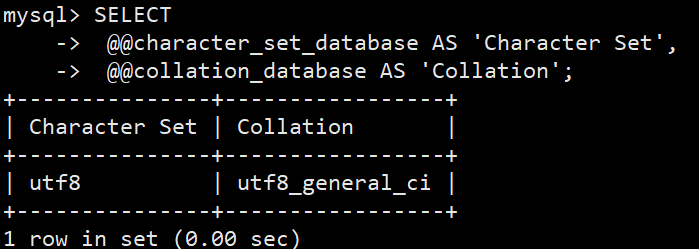
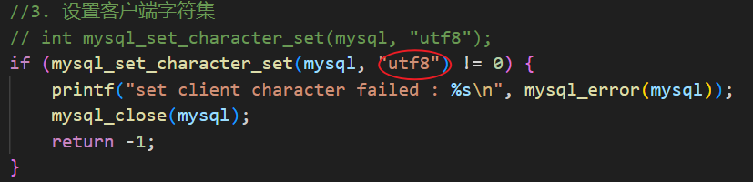
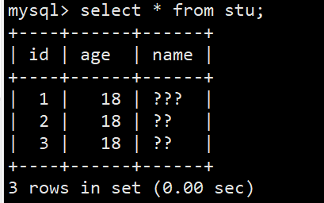

## pre

因为懒地在本地安装mysql，于是决定使用docker部署别人弄好的镜像，方便快捷，很好用。

## docker 部署 MySQL5.7

官方镜像仓库：https://hub.docker.com/_/mysql

1. 先 docker pull 下来想要的镜像版本
2. 然后 docker run ，指定端口映射、root账号密码等
3. 进入容器内交互 docker exec -it mysqlContainer bash

## 字符集 & 中文显示问题

服务端数据库中指定的字符集是需要和客户端写入时保持一致的：

我此刻是正确的。

但是遇到一个问题：

插入一些中文后，显示问号：

一开始以为是字符集的原因。

但其实不是，因为在其他客户端可以正常看到中文。

**原因是这个mysql容器，终端里没有支持显示中文。**

