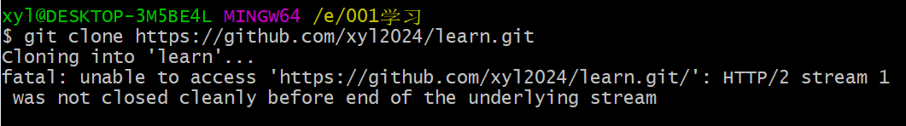
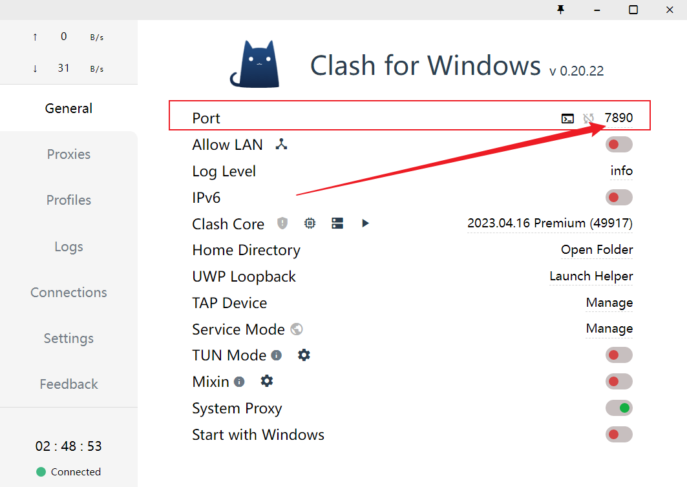

{\rtf1}

# 问题描述



本地挂了VPN，网页端可以访问github，但是git bash命令行依然没法正常访问github。

# 原因

git bash在拉取仓库时，没有使用vpn进行代理。

# 解决

```bash
git config --global http.proxy 127.0.0.1:7890
git config --global https.proxy 127.0.0.1:7890
```

