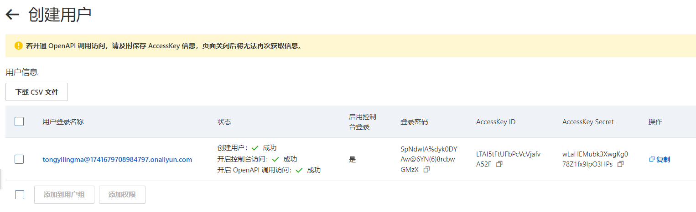

# 使用阿里云Access Key登录通义灵码

创建RAM用户的AccessKey https://help.aliyun.com/zh/ram/user-guide/create-an-accesskey-pair#section-rjh-18m-7kp

注意是RAM用户的AccessKey而不是阿里云账号的AccessKey。

创建完之后：

登录成功：

保存好AccessKey，因为一个账号能创建的数量有限！！！

存档

