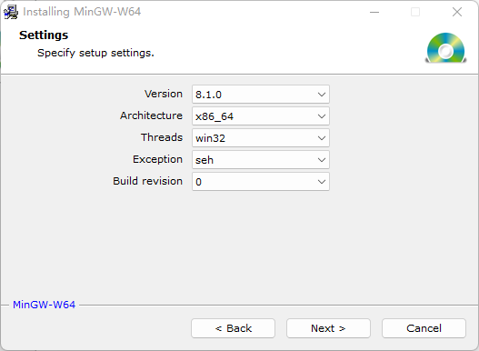
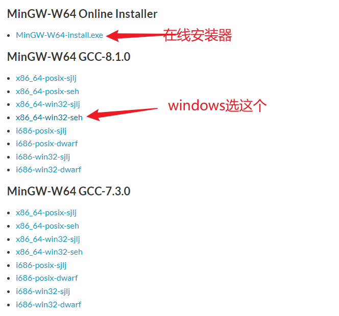
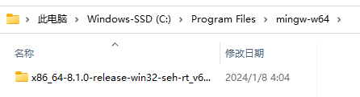
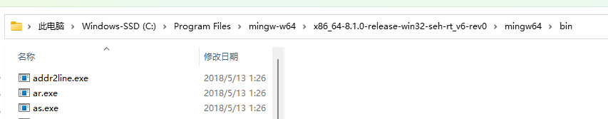
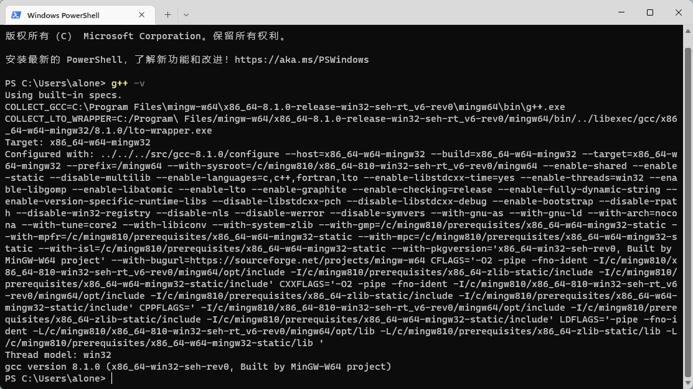

# 安装MinGW

**MinGW**（**Min**imalist **G**NU for **W**indows），又称**mingw32**，是将[GCC](https://zh.wikipedia.org/wiki/GCC)编译器和[GNU Binutils](https://zh.wikipedia.org/wiki/GNU_Binutils)移植到Win32平台下的产物，包括一系列头文件（[Win32API](https://zh.wikipedia.org/wiki/Windows_API)）、[库](https://zh.wikipedia.org/wiki/靜態連結函式庫)和[可执行文件](https://zh.wikipedia.org/wiki/可执行文件)。

另有可用于产生32位及64位Windows可执行文件的[**MinGW-w64**](https://zh.wikipedia.org/wiki/Mingw-w64)项目，是从原本MinGW产生的分支[[2\]](https://zh.wikipedia.org/wiki/MinGW#cite_note-2)。如今已经独立发展[[3\]](https://zh.wikipedia.org/wiki/MinGW#cite_note-3)。

下载 [MinGW-W64](https://sourceforge.net/projects/mingw-w64/files/Toolchains targetting Win32/Personal Builds/mingw-builds/installer/mingw-w64-install.exe/download)，这个是在线安装器

默认安装路径：C:\Program Files\mingw-w64\x86_64-8.1.0-win32-seh-rt_v6-rev0

在线安装器可能出错，也可以直接下载压缩包到本地：

https://sourceforge.net/projects/mingw-w64/files/

下到本地：

添加这个目录到PATH环境变量中：

测试是否安装成功：

