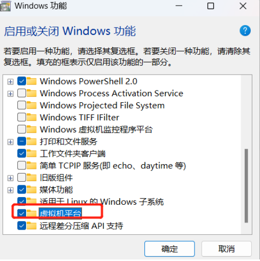
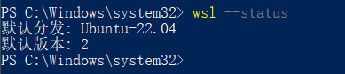
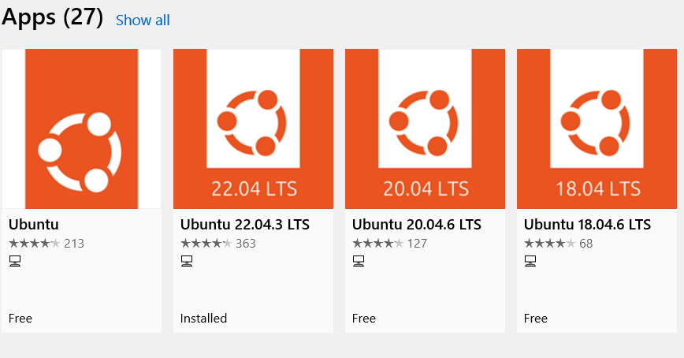
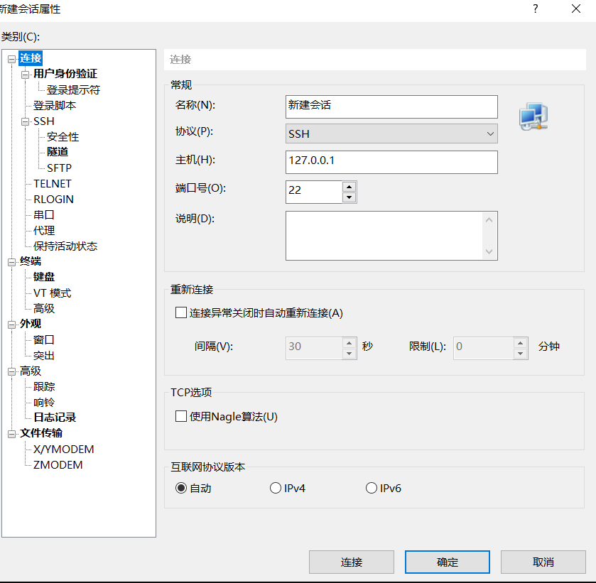

# Reference

WSL开发环境最佳实践：VSCode + WSL

[设置 WSL 开发环境 | Microsoft Learn](https://learn.microsoft.com/zh-cn/windows/wsl/setup/environment)


# 开启虚拟化



以管理员权限运行PowerShell，

```bash
查看版本：
wsl --status


更新到最新
wsl --update

设置默认版本
wsl --set-default-version 2
```



# 微软商店下载ubuntu



选择一个发行版下载即可。

耐心等待，即可自动帮你安装成功。

# xshell连接wsl

刚下载的ubuntu里面啥软件都没，而且Windows自带的操作wsl的终端太鸡肋，我们可以用ssh服务使用xshell连接本地wsl使用。

```bash
# 更新apt源
sudo apt update
# 下载ssh服务
sudo apt-get install openssh-server
# 下载完后就自动开启服务了
alonely@DESKTOP-3M5BE4L:~$ systemctl status ssh
● ssh.service - OpenBSD Secure Shell server
     Loaded: loaded (/lib/systemd/system/ssh.service; enabled; vendor preset: enabled)
     Active: active (running) since Sun 2024-01-14 02:51:35 CST; 47s ago
       Docs: man:sshd(8)
             man:sshd_config(5)
   Main PID: 1419 (sshd)
      Tasks: 1 (limit: 4573)
     Memory: 1.7M
     CGroup: /system.slice/ssh.service
             └─1419 "sshd: /usr/sbin/sshd -D [listener] 0 of 10-100 startups"

Jan 14 02:51:35 DESKTOP-3M5BE4L systemd[1]: Starting OpenBSD Secure Shell server...
Jan 14 02:51:35 DESKTOP-3M5BE4L sshd[1419]: Server listening on 0.0.0.0 port 22.
Jan 14 02:51:35 DESKTOP-3M5BE4L sshd[1419]: Server listening on :: port 22.
Jan 14 02:51:35 DESKTOP-3M5BE4L systemd[1]: Started OpenBSD Secure Shell server.
```

ssh服务开启后，就可以连接啦。

直接本地127.0.0.1:22连接即可！（当然也可以用ifconfig查看ip然后用那个ip）


